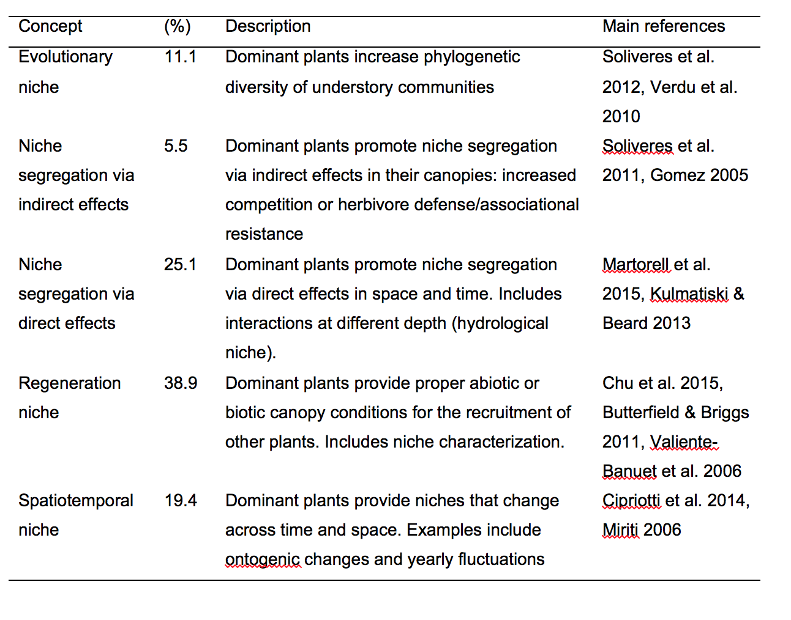

<br>  

###Introduction  
**A systematic review of positive interactions and the niche in deserts.**  
The niche is a powerful concept in ecology and at times not entirely coupled to local interactions between species. Herein, we review the capacity for these positive plant interactions to expand the niche of subdominant species. We synthesized the available literature using a formalized systematic review by using the Web of Science and associated terms with niche, positive interactions in plants such as facilitation, and deserts.  
<br>  

  
<br>

###Literature search & sort
```{r, literature, warning=FALSE, message=FALSE}
library(tidyverse)
library(DT)

#Search terms####
search.terms <- read_csv("data/search.terms.csv")
datatable(search.terms)

total.lit <- search.terms %>% filter(search != "final")
total.lit
totals <- sum(total.lit$hits)
totals
final.list <- 53
totals-final.list


#PRISMA####
#use 'prisma' function from PRISMAstatement 
#https://cran.r-project.org/web/packages/PRISMAstatement/vignettes/PRISMA.html
prisma.report <-read_csv("data/prisma.csv")
prisma.report
exclusions <- prisma.report %>% filter(inclusion == "N") %>% select(ID, category)
dim(exclusions)

library(PRISMAstatement)
#first search (2015)
prisma(found = 156,
       found_other = 0,
       no_dupes = 53, 
       screened = 53, 
       screen_exclusions = 0, 
       full_text = 53,
       full_text_exclusions = 24, 
       qualitative = 0, 
       quantitative = 29,
       width = 800, height = 800)

#second search (2017)
prisma(found = 196,
       found_other = 0,
       no_dupes = 70, 
       screened = 70, 
       screen_exclusions = 0, 
       full_text = 70,
       full_text_exclusions = 34, 
       qualitative = 0, 
       quantitative = 36,
       width = 800, height = 800)

#Summary of exclusions
categories <- exclusions %>% group_by(category) %>% tally() %>% arrange(desc(n))
categories

ggplot(categories, aes(category, n)) + geom_bar(stat = "identity") + coord_flip() + ylim(0,10)

```

###Search contrasts using DOI-matcher
```{r DOI matcher, warning=FALSE, message=FALSE}
search.1.1 <- read_csv("data/2016-search-total.csv")
search.1.2 <- read_csv("data/2017-search.csv")
net.difference <- anti_join(search.1.2, search.1.1, by = "DOI")
#net.difference <- net.difference %>% select(Title, DOI) #to simplify for a look
nrow(net.difference) #count of number of differences from consecutive search
#write_csv(net.difference, "data/net.difference.csv")

#double-check
net.difference <- anti_join(search.1.2, search.1.1, by = "Title")
nrow(net.difference)

```

###Systematic review



```{r review, warning=FALSE, message=FALSE}
data <- read_csv("data/data.csv")
data

#map####
#ggplot2 vers
require(maps)
world<-map_data("world")
map<-ggplot() + geom_polygon(data=world, fill="gray50", aes(x=long, y=lat, group=group))
map + geom_point(data=data, aes(x=long, y=lat)) + labs(x = "longitude", y = "latitude")

#data viz
data.simple <- data %>% group_by(niche.concept, ecosystem) %>% count()

ggplot(na.omit(data.simple), aes(niche.concept, n)) + geom_bar(stat = "identity") + coord_flip() + scale_fill_brewer(palette = "Blues") + labs(x = "niche concept", y =" frequency")

ggplot(na.omit(data.simple), aes(niche.concept, n, fill = ecosystem)) + geom_bar(stat = "identity") + coord_flip() + scale_fill_brewer(palette = "Blues") + labs(x = "niche concept", y =" frequency")
#too many levels

library(stringr)
data <- data %>% 
    rowwise() %>% 
    mutate(matches = str_replace(ecosystem,"^semi-arid.+", "semi-arid"))

data <- data %>% 
    rowwise() %>% 
    mutate(ecosystem = str_replace(ecosystem,"^semi-arid.+", "semi-arid")) %>% 
    mutate(ecosystem = str_replace(ecosystem,"^arid.+", "arid")) %>%
    mutate(ecosystem = str_replace(ecosystem,"^open.+", "other")) %>%
    mutate(ecosystem = str_replace(ecosystem,"^woodland.+", "other")) %>%
    mutate(ecosystem = str_replace(ecosystem,"^sub.+", "other"))
#can also do ifelse() or use replace from dyplr

data.simple <- data %>% group_by(niche.concept, ecosystem) %>% count()

ggplot(na.omit(data.simple), aes(niche.concept, n, fill = ecosystem)) + geom_bar(stat = "identity") + coord_flip() + scale_fill_brewer(palette = "Blues") + labs(x = "niche concept", y =" frequency")


#now, do we need stats? if more >= 5
36/5 #yes
c1<-chisq.test(data.simple$niche.concept, data.simple$n, simulate.p.value = TRUE, B = 10000)
c1 #n.s.

c1<-chisq.test(data.simple$ecosystem, data.simple$n, simulate.p.value = TRUE, B = 10000)
c1 #n.s.

#count up levels for summary in results
n_distinct(data$country)
n_distinct(data$niche.concept)
n_distinct(data$ecosystem)


```

###Meta-analysis  
The variation in methods, measrues, and reporting was to variable between and within studies within each major class of niche hypothesis. Hence, p-values with sample size estimates were extracted in all available instances.

**Decision rules for selecting p-values**  
1. A p-value listed for the relevant process associated with the niche.  For instance, there can be multiple measures tested and p-values reported. In this instance, extract the p-value most directly associated with the major niche concept.  If there were different sections within results, the section entitle niche was inspect in most detail.  
2. Record n for total number of fully independent samples.  For instance, the number of individual plants was sometimes listed as 1000 but there were only 8 plots.  Record n.reps as 8.  
3. The number of species is the number of species directly tested associated with the niche hypothesis only.  
4. If multiple responses were recorded and all were relevant to the niche hypothesis, select the p-max and/or measure that the authors interpreted as support for the mechanism.


```{r, evidence, warning=FALSE, message=FALSE}
#data from within each study
data <- read_csv("data/evidence.csv")
data <- data[!is.na(data$p), ]

#libary to use p-values for meta-analytic stats
library(metap)
schweder(data$p) # to explore validity of p-values to capture sense of whether it is a set of relatively small or large p-values as different combining probability tests have different assumptions.

sumz(p, data = data) #sumz assumes equal emphasis of large and small p-values
sumz(p, weights = n.reps, data = data) #weight by sample sizes

#then repeat for each hypothesis/niche.concept separately once all p-values collected

#sumz(p[niche.concept], data = data)
#sumz(data$p[niche.concept])

sumlog(data$p) #emphasis on small p-values and also known as Fisher’s method (most common combining probabitlities method) good general check

```

<br>  

###Interpretation  
1. Map of world and total of 11 different countries show that concept of niche not extensively tested in field globally.  
2. A total of 5 distinct niche concepts tested across 12 different ecosystems. This suggests an excellent start to field research on topic at this level with deserts.  
3. No significant differences between frequencies examined between ecosystem classes or different major niche concepts at this in point (limited number of independent tests).  
4. There was extensive variation in how the niche was tested within deserts within the context of positive interactions. The statistical tests were simple and relatively under-reported. The variation in measures precluded an effect size meta-analysis. Consequently, a combining p-value meta-analysis was done.

