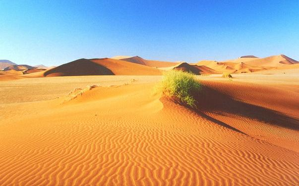

<br>  

###Introduction to desert niches
**A systematic review of positive interactions and the niche in deserts.**  
The niche is a powerful concept in ecology and at times not entirely coupled to local interactions between species. Herein, we review the capacity for these positive plant interactions to expand the niche of subdominant species. We synthesized the available literature using a formalized systematic review by using the Web of Science and associated terms with niche, positive interactions in plants such as facilitation, and deserts.  
<br>  

  
<br>

###Literature search & sort
```{r, literature, warning=FALSE, message=FALSE}
library(tidyverse)
library(DT)

#Search terms####
search.terms <- read_csv("data/search.terms.csv")
datatable(search.terms)

total.lit <- search.terms %>% filter(search != "final")
total.lit
totals <- sum(total.lit$hits)
totals
final.list <- 53
totals-final.list


#PRISMA####
#use 'prisma' function from PRISMAstatement 
#https://cran.r-project.org/web/packages/PRISMAstatement/vignettes/PRISMA.html
prisma.report <-read_csv("data/prisma.csv")
prisma.report
exclusions <- prisma.report %>% filter(inclusion == "N") %>% select(ID, category)
dim(exclusions)

library(PRISMAstatement)
prisma(found = 156,
       found_other = 0,
       no_dupes = 53, 
       screened = 53, 
       screen_exclusions = 0, 
       full_text = 53,
       full_text_exclusions = 24, 
       qualitative = 0, 
       quantitative = 29,
       width = 800, height = 800)

#Summary of exclusions
categories <- exclusions %>% group_by(category) %>% tally() %>% arrange(desc(n))
categories

ggplot(categories, aes(category, n)) + geom_bar(stat = "identity") + coord_flip() + ylim(0,10)

```

###Evidence synthesis
```{r synthesis, warning=FALSE, message=FALSE}

```

###Interpretationn

